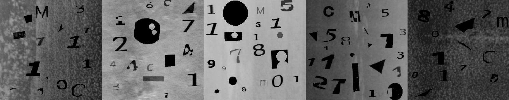
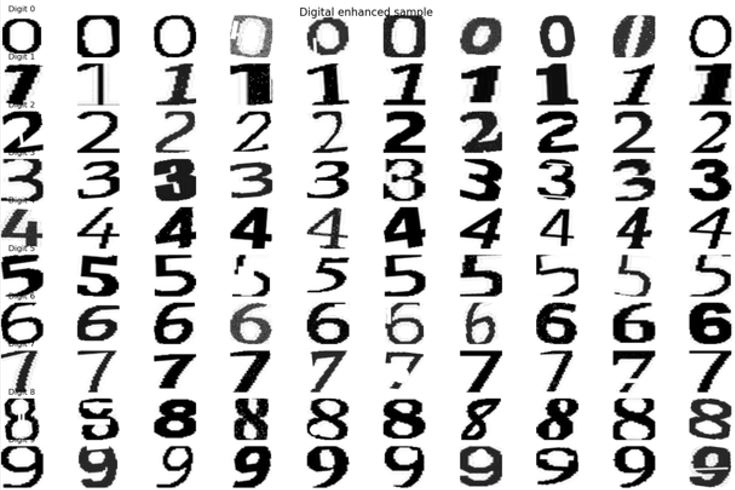
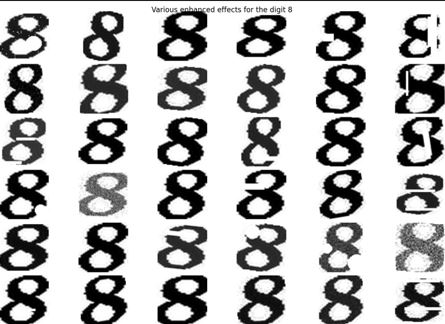
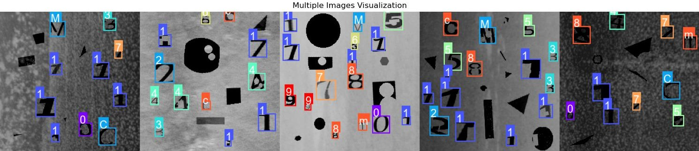

# IndustrialDigitDatasetGenerator



IndustrialDigitDatasetGenerator is a tool specifically designed for generating digital image datasets in industrial scenarios. It can extract digits (0-9) from system fonts and generate synthetic datasets suitable for industrial environments through various data augmentation techniques, supporting YOLO format object detection annotations. This tool supports multithreading, has simple dependencies, a modular design, and many adjustable parameters, making it easy to use.

## Keywords
**Industrial Digital Image**, **Industrial Instrument Detection**, **Instrument Automation**, **Dial Reading Recognition**, **Industrial Instrument Reading Recognition**, **Data Augmentation**, **Object Detection**, **YOLO Annotation**, **Font Extraction**, **Caliper Reading**

## Main Features

### [Font Extraction](#font-extraction)
- Automatically scan and extract font files from the system (default support for Windows and WSL, modify font directory for other systems)
- Filter out unsuitable special fonts
- Automatically crop and align digit images

### [Data Augmentation](#data-augmentation)
- **Noise Augmentation**
  - Gaussian noise
  - Salt and pepper noise
  - Speckle noise
  - Poisson noise

- **Image Transformations**
  - Random rotation
  - Perspective distortion
  - Aspect ratio adjustment
  - Grayscale adjustment
  - Random occlusion

- **Industrial Background**
  - Perlin noise generation
  - Real industrial image backgrounds (NEU-DET), can be added manually
  - Random stripes and stains

- **Random Pattern Interference Augmentation**
  - Circular patterns (solid/hollow)
  - Rectangular patterns (solid/hollow)
  - Triangular patterns (solid/hollow)
  - Hexagonal patterns (solid/hollow)
  - Vertical stripe patterns
  - Horizontal stripe patterns
  - Support for custom pattern colors
  - Adjustable pattern size and quantity
  - Adjustable pattern transparency
  - Random position and rotation angle

- **Letter Interference Augmentation**
  - Extract letters from font files
  - Random letter interference or annotation (for countering dial units)

### [Annotation Generation](#annotation-generation)
- Automatically generate YOLO format annotations, including bounding boxes and class information

## Installation Requirements

### Dependencies

Ensure the following Python libraries are installed:

- numpy
- Pillow
- matplotlib
- tqdm

Install them using the following command:

```bash
pip install numpy pillow matplotlib tqdm
```

Or, use our environment configuration:

```bash
conda create -n IDDG_env python=3.10
conda activate IDDG_env
pip install -r requirements.txt
```

## Usage

### 0. Download Real Industrial Background Dataset
We use the [NEU-DET](http://faculty.neu.edu.cn/songkechen/zh_CN/zdylm/263270/list/index.htm) dataset as the real industrial background. Please download it yourself and place it according to the [Project Structure](#project-structure).

### 1. Font Extraction
```bash
python font_extractor.py
```
Extract digit fonts from the system and save them in PNG format.

Tips:
- Manually review the extracted fonts before generating the dataset to avoid unsuitable fonts.
- If you know which font is used in your application scenario, you can modify the font directory in `default_config.py` to generate the specified font and improve dataset accuracy.

### 2. Dataset Generation
```bash
python font_png_augmentation.py
```
Generate a digital image dataset with industrial backgrounds using the extracted fonts.

### 3. Visualization Tools
```bash
python visualize_annotations.py
```
Visualize the generated images and their YOLO format annotations.

```bash
python test_noise_pattern.py
```
Visualize the effect of noise pattern generation.

```bash
python test_digit_augmentation.py
```
Visualize the effect of digit augmentation.

## Project Structure
```
IndustrialDigitDatasetGenerator/
├── NEU-DET/                 # Real industrial background image directory
│   └── IMAGES/             # Image directory
├── font_numbers/           # Extracted font image directory
│   ├── 0/
│   ├── 1/
│   ├── 2/
│   ├── 3/
│   ├── 4/
│   ├── 5/
│   ├── 6/
│   ├── 7/
│   ├── 8/
│   └── 9/                 
├── augmented_dataset/     # Generated dataset directory
├── docs/                  # Documentation directory
│   └── images/           # Documentation image directory
|—— default_config.py     # Default configuration parameters
├── font_extractor.py      # Font extraction tool
├── font_png_augmentation.py # Main program for dataset generation
├── test_digit_augmentation.py # Digit augmentation test tool
├── test_noise_pattern.py    # Noise pattern test tool
├── visualize_annotations.py # Annotation visualization tool
├── requirements.txt       # Dependency list
└── README.md             # Project description document
```

## Contribution Guidelines

Feel free to submit Issues and Pull Requests.

## License

This project is licensed under the MIT License. See the [LICENSE](LICENSE) file for details.

## Demonstration

### Data Augmentation Effects



### Pattern Interference Sample

*Examples of different types of random pattern interference*

### YOLO Annotation Visualization

 