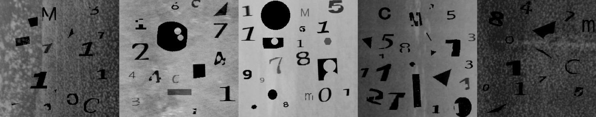
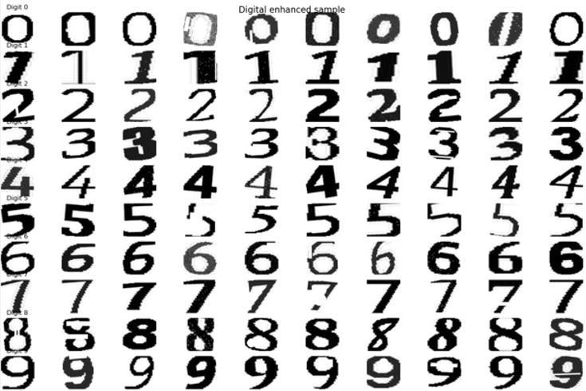
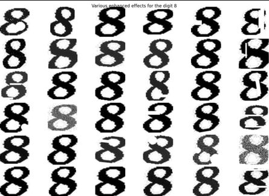
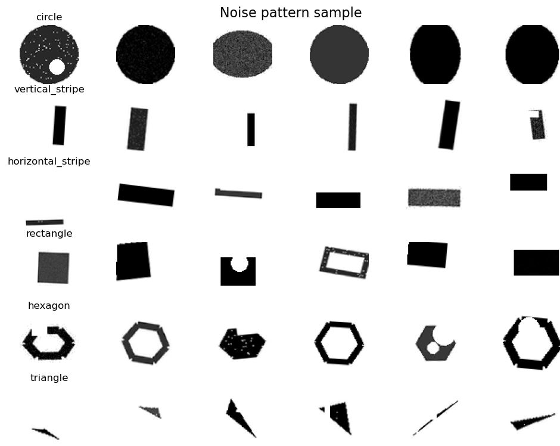
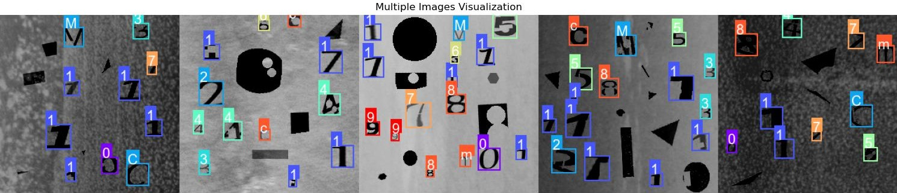
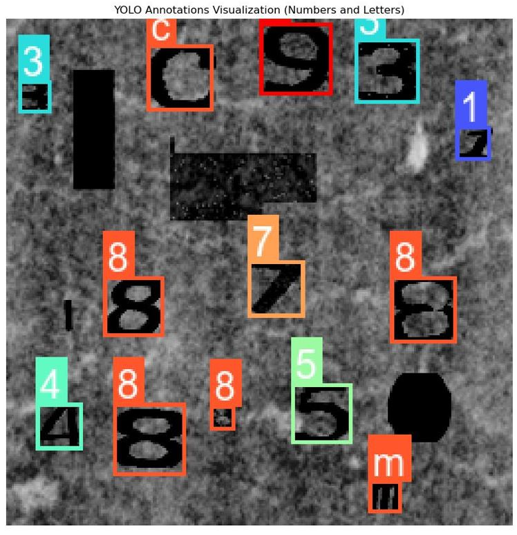

# IndustrialDigitDatasetGenerator

IndustrialDigitDatasetGenerator 是一个专门用于生成工业场景下数字图像数据集的工具。它能够从系统自带字体中提取数字(0-9)，并通过多种数据增强技术生成适用于工业环境的合成数据集，支持YOLO格式的目标检测标注。本工具支持多线程处理，依赖库简单，模块化设计，大量参数引出可供调节，易于使用。

[English Version](README_EN.md)

## 关键词 Keywords
 **工业数字图像**、**工业仪表检测**、**仪表自动化**、**仪表盘读数识别**、**工业仪表读数识别**、**数据增强**、**目标检测**、**YOLO标注**、 **字体提取** 、**游标卡尺自动读数**

 **Industrial Digital Image**、**Industrial Instrument Detection**、**Instrument Automation**、**Dial Reading Recognition**、**Industrial Instrument Reading Recognition**、**Data Augmentation**、**Object Detection**、**YOLO Annotation**、**Font Extraction**、**Caliper Reading**

## TODO List

- [ ] 添加自定义背景以及可供放置的区域🔴🔴🔴
- [x] 添加自定义字库
- [x] 添加自定义干扰图案库
- [ ] 添加数字1紧凑处理🔴🔴
- [ ] 添加形态学处理
- [ ] 添加数字放到背景图像中，添加图像融合🔴
- [ ] 衬线和无衬线字体的区分
- [ ] **bug**: png图像中的颜色数据（CData）和透明度数据（AlphaData）
- [x] 字体提取添加更多路径，添加linux支持
- [x] 添加种子抑制随机
- [x] **bug**: pillow库版本问题，目前至少一个textsize兼容问题
- [x] 添加字体提取部分的提示，说明提取了多少种

## 主要功能

### 字体提取
- 自动扫描并提取系统中的字体文件(默认支持Windows系统和WSL,其他系统修改字体目录即可)
- 过滤不适用的特殊字体
- 自动裁剪和对齐数字图像

### 数据增强
- **噪声增强**
  - 高斯噪声
  - 椒盐噪声
  - 斑点噪声
  - 泊松噪声

- **图像变换**
  - 随机旋转
  - 透视变形
  - 长宽比调整
  - 灰度调整
  - 随机遮挡

- **工业背景**
  - 柏林噪声生成
  - 真实工业图像背景(NEU-DET)，可自行添加
  - 随机条纹和污点

- **随机图案干扰增强**
  - 圆形图案（实心/空心）
  - 矩形图案（实心/空心）
  - 三角形图案（实心/空心）
  - 六边形图案（实心/空心）
  - 垂直条纹图案
  - 水平条纹图案
  - 支持自定义图案颜色
  - 支持调节图案大小和数量
  - 支持调节图案透明度
  - 随机位置和旋转角度

- **字母干扰增强**
  - 从字体文件提取字母
  - 进行随机字母干扰或者标注（用于对抗表盘单位）


### 标注生成
- 自动生成YOLO格式标注,包含边界框和类别信息

## 安装要求

### 依赖库

确保已安装以下Python库：

- numpy
- Pillow
- matplotlib
- tqdm

可以通过以下命令安装：

```bash
pip install numpy pillow matplotlib tqdm
```
或者, 这是我们的环境配置。
```bash
conda create -n IDDG_env python=3.10
conda activate IDDG_env
pip install -r requirements.txt
```

## 使用方法

### 0. 下载真实工业背景数据集
我们使用[NEU-DET](http://faculty.neu.edu.cn/songkechen/zh_CN/zdylm/263270/list/index.htm)数据集作为真实工业背景，请自行下载，并按照[项目结构](#项目结构)放置。

### 1. 字体提取
```bash
python font_extractor.py
```
从系统中提取数字字体并保存为PNG格式。

Tips：
- 对于提取出来的字体进行手动查看之后再生成数据集，以防提取出不合适的字体。
- 如果你知道你所应用的场景是哪一种字体，可以修改`default_config.py`中的字体目录，生成指定的字体以提高数据集的精确度。

### 2. 数据集生成
```bash
python font_png_augmentation.py
```
使用提取的字体生成带有工业背景的数字图像数据集。

### 3. 可视化验证工具
```bash
python visualize_annotations.py
```
可视化生成的图像及其YOLO格式标注。

```bash
python test_noise_pattern.py
```
可视化测试噪声图案生成效果  

```bash
python test_digit_augmentation.py
```
可视化测试数字增强效果


## 项目结构
```
IndustrialDigitDatasetGenerator/
├── NEU-DET/                 # 真实工业背景图片目录
│   └── IMAGES/             # 图片目录
├── font_numbers/           # 提取的字体图片目录
│   ├── 0/
│   ├── 1/
│   ├── 2/
│   ├── 3/
│   ├── 4/
│   ├── 5/
│   ├── 6/
│   ├── 7/
│   ├── 8/
│   └── 9/                 
├── augmented_dataset/      # 生成的数据集目录
├── custom_background/   # 自定义背景图片目录
├── custom_noise_patterns/ # 自定义干扰图案目录
├── template_num/          # 自定义字体目录
├── docs/                  # 文档目录
│   └── images/           # 文档图片目录
|—— default_config.py      # 默认配置参数
├── font_extractor.py      # 字体提取工具
├── font_png_augmentation.py # 数据集生成主程序
├── test_digit_augmentation.py # 数字增强测试工具
├── test_noise_pattern.py    # 噪声图案测试工具
├── visualize_annotations.py # 标注可视化工具
├── requirements.txt       # 依赖库列表
└── README.md             # 项目说明文档
```

## 贡献指南

欢迎提交 Issue 和 Pull Request。


## 许可证

本项目采用 MIT 许可证。详情请参阅 [LICENSE](LICENSE) 文件。

## 效果展示

### 数据增强效果




### 图案干扰样本示意

*不同类型的随机图案干扰示例*

### YOLO标注可视化



